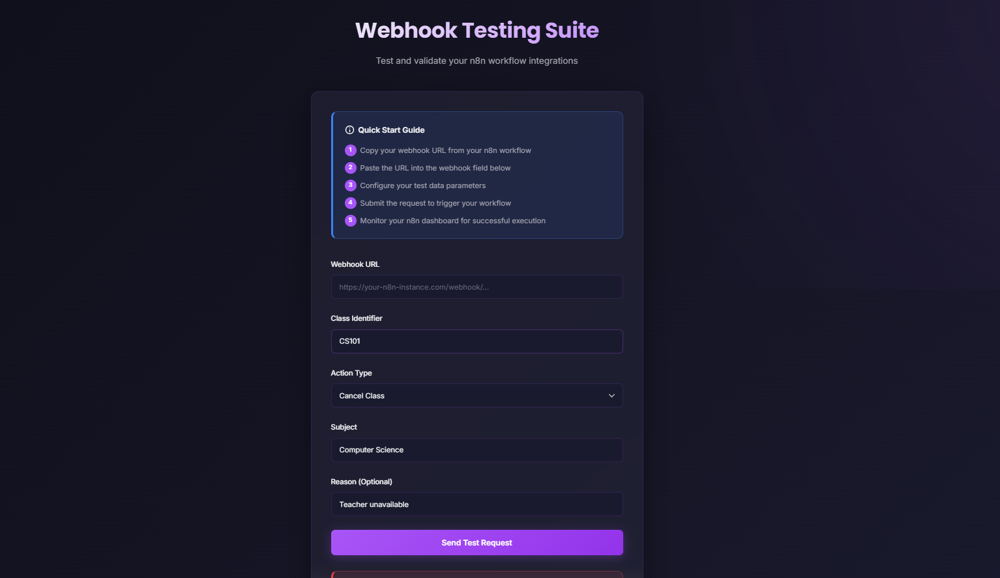
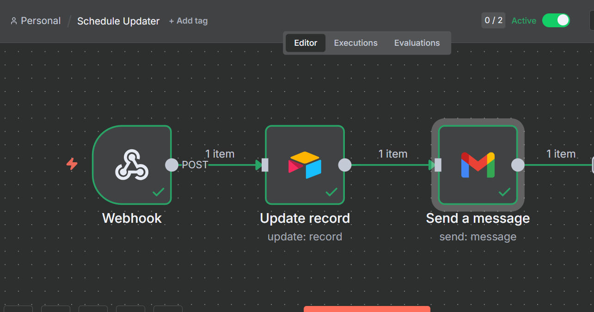
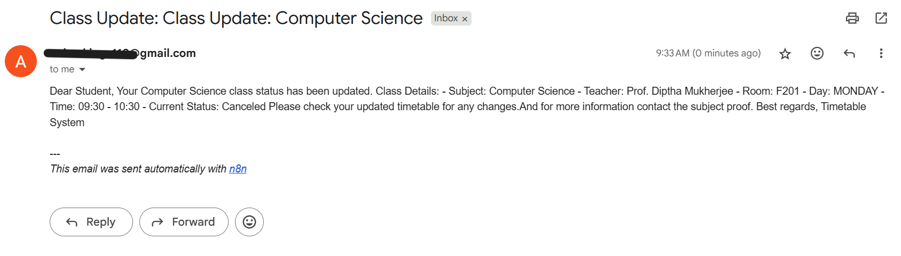
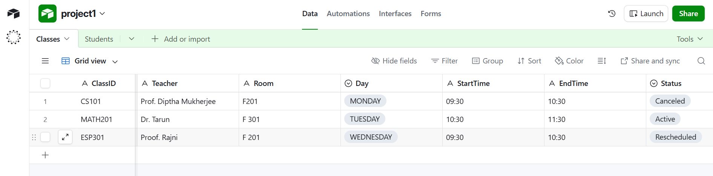

# 🎓 schedule_updater0

An intelligent timetable management system that automatically adjusts schedules when classes are canceled or rescheduled, and instantly notifies all affected students and teachers.


## 📋 Table of Contents
- [Overview](#overview)
- [Features](#features)
- [Tech Stack](#tech-stack)
- [System Architecture](#system-architecture)
- [Screenshots](#screenshots)
- [Contributing](#contributing)

## 🎯 Overview

schedule_updater0 is a real-time schedule management system designed for educational institutions. When a class is canceled, rescheduled, or modified, the system automatically:
- Updates the centralized timetable database
- Identifies all affected students and teachers
- Sends instant notifications via multiple channels
- Maintains a complete audit trail of all changes

Built for a 8-hrs hackathon project, this system uses entirely free resources and demonstrates workflow automation, database management, and multi-channel notifications.

## ✨ Features

- **Real-time Updates**: Instant timetable modifications with zero manual intervention
- **Multi-channel Notifications**: Email, Telegram, and other messaging platforms. (Here we only used email notification)
- **Smart Matching**: Automatically identifies affected students and teachers
- **Audit Trail**: Complete history of all schedule changes
- **No-code Automation**: Built using n8n workflow automation
- **Free Infrastructure**: Uses only free-tier services (Airtable, n8n Cloud, Gmail)
- **Webhook API**: Simple REST API for schedule modifications
- **User-friendly Interface**: Clean admin panel for managing changes


## 🛠 Tech Stack

| Component | Technology | Purpose |
|-----------|-----------|---------|
| **Automation** | n8n Cloud | Workflow orchestration and automation |
| **Database** | Airtable | Timetable and user data storage |
| **Notifications** | Gmail API | Email notifications to users |
| **Frontend** | HTML/CSS/JS | Admin interface for schedule management |
| **API** | Webhook (REST) | Trigger endpoint for schedule changes |


## 🏗 System Architecture

```
┌─────────────┐
│   Admin     │
│  Interface  │
└──────┬──────┘
       │ HTTP POST
       ▼
┌─────────────┐
│   Webhook   │
│  (Trigger)  │
└──────┬──────┘
       ▼
┌─────────────┐      ┌──────────────┐
│   n8n       │─────▶│   Airtable   │
│  Workflow   │      │   Database   │
└──────┬──────┘      └──────────────┘
       ├─────────────┐
       ▼             ▼
┌─────────────┐  ┌──────────────┐
│    Gmail    │  │   Telegram   │
│   (Email)   │  │    (Chat)    │
└─────────────┘  └──────────────┘
       │             │
       ▼             ▼
   Students      Teachers
```

## 📸 Screenshots

### Admin Interface

*Simple interface for managing schedule changes*

### Workflow Visualization

*Automated workflow in n8n*

### Email Notification

*Sample notification sent to students*

### Airtable Database

*Centralized timetable storage*

## 🤝 Contributing

Contributions are welcome! Please follow these steps:

1. Fork the repository
2. Create a feature branch (`git checkout -b feature/AmazingFeature`)
3. Commit your changes (`git commit -m 'Add some AmazingFeature'`)
4. Push to the branch (`git push origin feature/AmazingFeature`)
5. Open a Pull Request

---

**⭐ If you found this project helpful, please consider giving it a star!**

Made with ❤️ for Hackathon 2025
